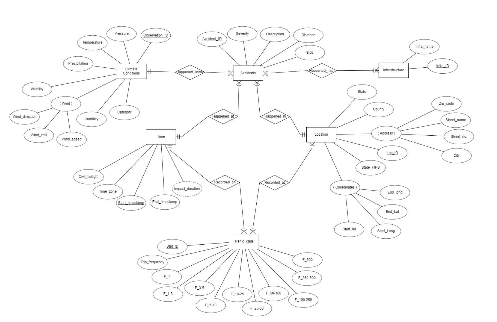
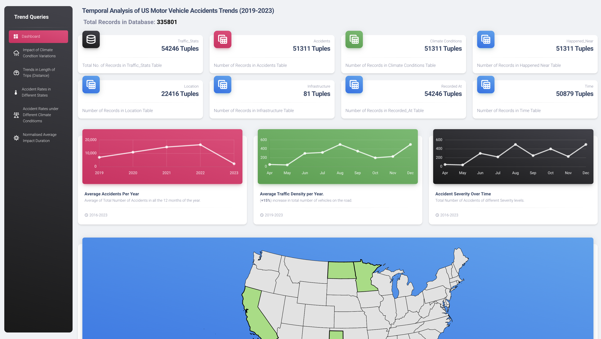

# Temporal Analysis of US Motor Vehicle Accident Trends <br>(COP-5725-DBMS-Project)

## 1.Introduction

**1.1 Overview of the Application**

The United States of America is one of the most car-dependent nations in the world. According to data from the Federal Highway Administration, there are over 280 million registered vehicles in the country, which roughly equates to about 8 in 10 Americans owning a car. Furthermore, the U.S. Bureau of Transportation Statistics reports that Americans collectively travel over 3 trillion miles annually by car. Using a personal vehicle for transportation is the preferred choice for most Americans because of widespread suburban development of many American cities, coupled with underdeveloped public transportation networks.

Even though the US is home to one of the most extensive road networks in the world, its performance in terms of road accidents is quite concerning. The country's fatality rate per 100,000 inhabitants consistently outranks many of the developed nations. Although recent advancement in technology and road safety campaigns have contributed to improving the condition, statistics indicate that there is a need for continued focus on road safety measures.

It is for this reason that this application focuses on the analysis of traffic and accidents-related data in the USA. To ensure road safety and efficiency, understanding traffic patterns and accident causality is essential. By analyzing the data captured via traffic cameras and traffic sensors within the road-networks, crucial insights can be drawn about high-risk zones, effectiveness of current road safety measures, and the correlation between environmental factors and accident rates. Such analysis also aids in urban planning by helping to decongest traffic bottlenecks and optimize public transport routes. Reducing accident rates can significantly decrease healthcare and infrastructure repair costs, thus providing an additional economic benefit. We intend to create a safer, smarter, and more sustainable urban environments by improving the roadways infrastructure by analyzing the temporal trends in road accident data.

**1.2 Project Description**

Our research project will harness the comprehensive data from two pivotal datasets: The "US-Accidents dataset" and the "Trips by Distance" data, made available by the Bureau of Transportation Statistics (BTS). The "US-Accidents dataset," is vast collection of approximately 7.7 million accident records extracted from 49 states in US since February 2016. This dataset provides invaluable insights into the circumstances and locations of road accidents. Our analysis is focused on finding temporal patterns in accident occurrences, diving deep into factors like environmental stimuli, proximity to roadway constructs like roundabouts, signals, pedestrian crossing, traffic density and number of active automobiles on the road. 

On the other hand, the "Trips by Distance" dataset contains information collected from anonymous mobile device data. It offers a general understanding of the nation's mobility patterns. Attributes like the frequency, distance, and nature of trips, will help us to understand the causality in the accidents data since we juxtapose movement trends with it. By studying both the datasets simultaneously our objective is to reveal correlations between population mobility patterns and accident rates by studying the trends over a period of 5 years.

## 2. Motivation

**2.1 Database needs of the application**

The application titled “Temporal Analysis of US Motor Vehicle Accident Trends and its impact on Traffic” requires a robust database that incorporates a diverse range of crucial data sources. The inclusion of comprehensive accident records in this database is vital. These records should encompass many details including the data, time, and location of each accident as well as the severity of the incidents, the vehicles involved and the contributing reasons. The size of this data is very large as it includes more than 7.7 million records. Using a relational database for such a project is the right choice for the following reasons:

1. **Structured Storage**: Both the datasets used in this application are structured Comma Seperated Values with predefined columns (fields) and rows (records). This structured approach is ideal as the data stored in these datasets all follow a particular data type and have atomic values. 
2. **Data Integrity**: Relational databases enforce data integrity using constraints (like primary and foreign keys). This ensures consistent and accurate data storage. Since many records in these raw datasets often have garbage data where some values are missing or incorrect or inconsistent. Having Integrity constraints in place will be helpful to prevent the insertion of bad records. For instance, an accident record can't be entered without a valid state or county, ensuring that each entry is complete.
3. **Efficient Retrieval**: With complex datasets, you often need to fetch specific pieces of information rapidly. SQL (Structured Query Language) facilitates quick and complex queries, enabling you to efficiently analyze temporal trends or retrieve accident counts for specific regions.
4. **Scalability**: The size of the dataset is already very large and its anticipated to grow overtime as these datasets are regularly updated by the US government with the lates data. Since relational databases are designed to manage large volumes of data without sacrificing performance, they are the ideal choice for this use case.
5. **Data Relationships**: The data stored in the datasets include multiple entities which have multiple interrelations. For example, a specific region (state, city) will relate to various accidents. Relational databases allow you to establish and exploit these relationships for more in-depth analysis.
6. **Concurrent Access**: Databases are designed for multi-user environments. If multiple user access the webpage at the same time and query the database for different constraints the DBMS will handle the concurrent access on its own ensuring data remains consistent.

9. **Optimized Performance**: Modern relational databases have been optimized for performance. They use efficient algorithms, indexing, and caching mechanisms to ensure fast data retrieval and storage. Optimized search performance is crucial while dealing with such large data sets.
10. **Flexibility in Analysis**: Relational databases allow for the integration with numerous tools and software for further data analysis. Whether it's Business Intelligence tools or statistical software, you can seamlessly connect them to your database for richer insights.
Given the intricacies and the vast scope of your project, utilizing a relational database not only provides an efficient storage mechanism but also equips you with tools essential for rigorous analysis and insightful conclusions.

**2.2 Potential User Interest in the Application**

The potential users and their interests in the application are as follows:
1. **General Public**: People can use such applications to plan their journeys, opt for routes for faster commutes and avoid potential delays caused by road accidents. The general public can also be aware of accident-prone areas and drive responsibly in such areas to avoid catastrophic consequences using this application.
2. **Emergency services**: Emergency services require faster commutes than the general public. Awareness about faster routes increases the probability of saving more lives. Additionally, such service-providing agencies can be prepared near accident-prone areas.
3. **Law agencies**: Police departments can use such data to locate to areas where the chances of accidents are higher. They can also use this data to provide it to government agencies to ensure proper planning and infrastructure of such areas in the future.
4. **Automobile industry**: The automobile industry can use such data to create improvements in their models by analyzing the factors that caused such accidents. Additionally, they can upgrade their safety services according to the description of the cause of the accident.
5. **Architect Planners**: Architects and city planners can plan their future projects by learning from the flaws of previous ones. The description of the cause of accidents provided in the dataset is a great source of information to plan the projects accordingly.
6. **Researchers**: Researchers can use this data as a skeleton for the creation of more complex datasets. This dataset and the application can also form a foundation for various applications that can be imagined.

## 3.  Web Application Goals

**3.1 Description of the Needed Web Based User Functionality**

The application will be designed such that a user can visualize the trends in accidents patterns over a specified time period. The User Interface will be a progressive web application which will be interactive in nature thus allowing the user to adjust the granularity of the data presented on screen.
The user will have the ability to adjust data filters to target information in his/her specific area of interest. This means user will have the flexibility to:

1. Switch between the various views provided to the user where each view will present one of the complex trend queries performed on the dataset.
2. Drill down into the weather conditions and filter the data recorded during a specific weather condition (rain, snow, thunderstorm, fog, etc). 
3. Switch between various parameters that are used to monitor climatic conditions, road friction, vehicle maneuverability, etc. The options available to user will be Temperature, Windchill, Humidity, Pressure, Visibility, Wind Direction, etc.
4. User can choose to filter only those accident records which were recorded in close proximity to a specific amenity or roadway construct like Speed Bump, Crossing, Railway, Signal etc.
5. User can filter out data recorded specifically within a state, county, city, zip code or time zone.
6. User can choose to filter records which were recorded during daytime only or nighttime only.
7. Choose a specific start date and end date to filter out data within a specific time interval.
A user’s preferred setting will be stored in users web browser so that he need not apply the filter again and again while switching between the various views.


## 4. Trend Analysis

**4.1 Description of the application goals regarding trend analysis.**

The application goals regarding trend analysis of the dataset can be categorized as follows:

1. **Climatic conditions**: The trend analysis of accident data with respect to factors such as temperature, windchill, humidity, pressure, visibility, wind direction, wind speed and precipitation. The analysis of changes in accident rates with respect to these factors over time is one of the application goals of the trend analysis of this dataset.

2. **Infrastructure**: The rate of cause of accidents and their severity also depends on various infrastructural factors. One of the goals of the analysis also include the proximity of road accidents near infrastructural elements such as amenities, bumps, crossings, junctions, railway lines, stations, and other road elements. These proximities are calculated over time and hence trend analysis is the paramount of importance.

3. **Lighting Conditions**: The analysis of lighting conditions is crucial to check the dependence of road accidents on these conditions. Such analysis can render the relation of accident data with conditions such as sunrise, sunset and civil twilight.

4. **Other Categories**: Various other categories also include severity, city, county, state, zip code, and time zone. These categories have a direct impact on traffic, such as slight delays and long delays. Such categories are important to study to determine the delay in traffic.

5. **Location Data**: The latitude longitude street, city, state, and the distance of a traffic jam determine the exact location of a traffic jam. Determining the changes in the location of the exact traffic jam over time can determine the rate of change in accident-prone areas, which is of crucial importance to emergency services and other applications. 

**4.2 Description of the real-world data forming the basis of the application and the complex trend queries.**

The interpretation of data obtained result in the following inferences: 

1. **Nature of data**: The data indicates a thorough examination of the chronological progression of motor vehicle accidents in the United States and the resulting effects on traffic flow. The data is in form of a table that has columns that determine the factors on which road accidents are dependent. The values in the cells are of datatypes String(Description of exact cause of accident, infrastructure near accident, etc), Boolean(whether the accident is caused at a junction, railway line, etc), Integer and Floating point values(numerical data of weather conditions). 

2. **Properties**: The dataset is comprehensive in terms of the location of accidents caused. The location (latitude, longitude, proximity to amenities) details provided are precise and can be easily interpreted. Complex trend queries based on factors related to location can provide a large scope for data interpretation and trend analysis applications. The data is taken from data.gov which is the US government website that proves its integrity and authenticity.

The data also provide the weather details of accident areas through the collection of weather 	data from the nearest airport. This ensures the accuracy of weather conditions which in turn 	reduces the margin of error to a huge extent.  

3. **Weaknesses**: There are some cases where the dataset has scope of improvements. Cases such as: the end times of traffic delays have some values that are too large and therefore need to be normalized. Additionally, the severity of traffic delays and jams are mentioned but the severity of casualties and damage caused to human life is missing. Such detail would elaborate the need of serious action and therefore would be crucial.

## 5. Database Design


**5.1 ER Diagram of the Application**

The following ER Diagram depicts the design of our database schema:



**5.2 Relational Schemas**
1. Climate Conditions(Observation_ID: String, Pressure: Real Number, Temperature: Real Number, Precipitation: Real Number, Visibility: Real Number, Humidity: Real Number, Category: String, Wind_direction: String, Wind_chill: String, Wind_speed:Real Number)

2. Infrastructure( Infra_ID:String, Infra_name:String) Time(Start_timestamp:DateTime, Civil_twilight: string, Time_zone:string, End_timestamp:DateTime , Impact_duration:number)

3. Location(Loc_ID: String: State: String, Country: String, State_FIPS: String, Zip_code: String, Street_name : String, Street_no: String, City: String, Start_lat: String, End_lat: String, Start_long: String, End_long: String)

4. Traffic_stats(Stat_ID: String, Start_timestamp:DateTime, Trip_frequency: Integer, F_1: Integer, F_1-3: Integer, F_3-5: Integer, F_5-10: Integer, F_10-25: Integer, F_25-50: Integer, F_50-100: Integer, F_100-250: Integer, F_250-500: Integer, F_500: Integer)

5. Accidents(Accident_ID: String, Observation_ID: String, Start_timestamp: DateTime, Loc_ID: String, Severity: Real Number, Description: String, Distance: String, Side: String)

6. Happened_Near(Accident_ID: String , Infra_ID : String) Recorded_at( Stat_ID: String, Loc_ID: String )

## 6. Technology Stack

For the development of this project, we will be implementing the Three-Tier Architecture:

The Three-Tier Architecture is a popular architectural pattern that segregates an application into three interconnected components:

1. **Presentation Tier (Front End)** - The visual tier where users interact with the application, focusing on user experience and web interface design.
2. **Application Tier** - The logical layer that processes data, managing business rules, and controlling application functionality.
3. **Data Tier** - The foundational storage component, responsible for securely storing and retrieving data, ensuring integrity and reliability.

This division ensures modularity, scalability, maintainability, and efficient distribution of responsibilities. For our Accident and Traffic Data Analysis Application, we've judiciously selected technologies for each tier to best serve the project's objectives.

We have chosen the following technologies for each tier:

**1. Presentation Tier (Front-End): Angular**
   We chose Angular for the front-end development due to the following reasons:
   1. **Two-Way Data Binding**: Ensures that the UI is always in sync with the underlying data. Any changes in the backend are instantly reflected in the UI and vice-versa.
   2. **Modularity**: Angular promotes modularity, making it easier to manage, update, and scale the application.
   3. **Performance**: Angular’s change detection mechanism and ahead-of-time (AOT) compilation ensures speedy rendering, enhancing user experience.

**2. Application Tier (Logic Layer): Python Flask**
   We chose Python Flask for the back-end development due to the following reasons:
   1. **Streamlined Development**: Python Flask offers a simple and lightweight framework for building web applications, enabling rapid development and deployment.
   2. **Extensibility**: Flask allows easy integration with various extensions and libraries, facilitating the addition of new features and functionalities as needed.
   3. **Python Ecosystem**: Leveraging Python's vast ecosystem, Flask provides access to a wide range of third-party tools and resources for efficient development.

**3. Data Tier (Data Layer): Oracle Database**
   As per the requirements of the project, we have chosen Oracle DB as the underlying DBMS. Some of the features of Oracle are as follows:
   1. **Performance Optimizations**: With in-memory processing and optimized query execution, Oracle ensures rapid data retrieval and storage.
   2. **Security**: Oracle provides enterprise-grade security features, from encryption to user access controls, vital for safeguarding sensitive data.
   3. **Scalability & Concurrency**: Oracle efficiently handles large datasets and supports high concurrency, ensuring seamless performance as the data volume grows.

## 7. Application & Interface Design

### 7.1 Screen 0 - Dashboard



### 7.2 Screen 1 - Impact of Climate Condtion Variations

#### Demo

#### Underlying sql query
```sql
SELECT monthly_state.month, 
                (monthly_state.monthly_precipitation - yearly_state.yearly_precipitation) as mprep,
                (monthly_state.monthly_visibility - yearly_state.yearly_visibility) as mvis,
                (monthly_state.monthly_pressure - yearly_state.yearly_pressure) as mpressure,
                (monthly_state.monthly_wind_chill - yearly_state.yearly_wind_chill) as mwind_chill,
                (monthly_state.monthly_humidity - yearly_state.yearly_humidity) as mhumidity,
                (monthly_state.monthly_wind_speed - yearly_state.yearly_wind_speed) as mwind_speed,
                monthly_state.accident_count
            FROM
                (
                    SELECT DISTINCT TO_CHAR(A.Start_Time, 'MM-YYYY') as month, 
                                    AVG(cc.precipitation) OVER (PARTITION BY L.state) as monthly_precipitation,
                                    AVG(cc.visibility) OVER (PARTITION BY L.state) as monthly_visibility,
                                    AVG(cc.pressure) OVER (PARTITION BY L.state) as monthly_pressure,
                                    AVG(cc.wind_chill) OVER (PARTITION BY L.state) as monthly_wind_chill,
                                    AVG(cc.humidity) OVER (PARTITION BY L.state) as monthly_humidity,
                                    AVG(cc.wind_speed) OVER (PARTITION BY L.state) as monthly_wind_speed,
                                    Count(a.accident_id) OVER (PARTITION BY L.state) as accident_count,
                                    L.state  
                    FROM Accidents A, Climate_Conditions CC, Time T, Location L
                    WHERE a.start_time = T.start_time
                        AND a.observation_id = cc.observation_id 
                        AND L.zip_code = a.zipcode
                        AND TO_CHAR(a.Start_Time, 'YYYY-MM') = '{current_date}'
                        AND L.state = '{state}'
                ) monthly_state,
                
                (
                    SELECT DISTINCT TO_CHAR(A.Start_Time, 'YYYY') as month, 
                        AVG(cc.precipitation) OVER (PARTITION BY L.state) as yearly_precipitation,
                        AVG(cc.visibility) OVER (PARTITION BY L.state) as yearly_visibility,
                        AVG(cc.pressure) OVER (PARTITION BY L.state) as yearly_pressure,
                        AVG(cc.wind_chill) OVER (PARTITION BY L.state) as yearly_wind_chill,
                        AVG(cc.humidity) OVER (PARTITION BY L.state) as yearly_humidity,
                        AVG(cc.wind_speed) OVER (PARTITION BY L.state) as yearly_wind_speed,
                        L.state  
                    FROM Accidents A, Climate_Conditions CC, Time T, Location L
                    WHERE a.start_time = T.start_time 
                        AND a.observation_id = cc.observation_id 
                        AND L.zip_code = a.zipcode
                        AND TO_CHAR(a.Start_Time, 'YYYY') = '{current_date[:4]}'  -- Extracting the year part
                        AND L.state = '{state}'
                ) yearly_state
            WHERE monthly_state.state = yearly_state.state;
```

### 7.3 Screen 2 - Variation in Length of Trips

#### Demo

#### Underlying sql query
```sql
WITH MonthlyTripData AS (
        SELECT
            TO_CHAR(ts.Start_Time, 'YYYY-MM') AS day,
            SUM(ts.trip_frequency) AS trips_total,
            SUM(ts.trips_lt1) AS trips_lt1,
            SUM(ts.trips_1_3) AS trips_1_3,
            SUM(ts.trips_3_5) AS trips_3_5,
            SUM(ts.trips_5_10) AS trips_5_10,
            SUM(ts.trips_10_25) AS trips_10_25,
            SUM(ts.trips_25_50) AS trips_25_50,
            SUM(ts.trips_50_100) AS trips_50_100,
            SUM(ts.trips_100_250) AS trips_100_250,
            SUM(ts.trips_250_500) AS trips_250_500,
            SUM(ts.trips_gt500) AS trips_gt500
        FROM
            traffic_stats ts
        JOIN
            recorded_at ra ON ts.stat_id = ra.stat_id
        WHERE
            ra.State = ' {state} '
        GROUP BY
            TO_CHAR(ts.Start_Time, 'YYYY-MM')
        ORDER BY TO_CHAR(ts.Start_Time, 'YYYY-MM')
    )
    SELECT
        day,
        trips_total,
        ROUND(trips_lt1 / trips_total * 100, 2) AS trips_lt1,
        ROUND(trips_1_3 / trips_total * 100, 2) AS trips_1_3,
        ROUND(trips_3_5 / trips_total * 100, 2) AS trips_3_5,
        ROUND(trips_5_10 / trips_total * 100, 2) AS trips_5_10,
        ROUND(trips_10_25 / trips_total * 100, 2) AS trips_10_25,
        ROUND(trips_25_50 / trips_total * 100, 2) AS trips_25_50,
        ROUND(trips_50_100 / trips_total * 100, 2) AS trips_50_100,
        ROUND(trips_100_250 / trips_total * 100, 2) AS trips_100_250,
        ROUND(trips_250_500 / trips_total * 100, 2) AS trips_250_500,
        ROUND(trips_gt500 / trips_total * 100, 2) AS trips_gt500
    FROM
        MonthlyTripData;
```

### 7.4 Screen 3 - Accident Rates in Different States

#### Demo

#### Underlying sql query
```sql
SELECT TO_CHAR(A.Start_Time, 'YYYY-MM') as month, COUNT(a.accident_id)
        FROM ACCIDENTS A
        JOIN LOCATION L ON A.zipcode = L.zip_code
        WHERE L.state = :state
        GROUP BY TO_CHAR(A.Start_Time, 'YYYY-MM')
        ORDER BY TO_CHAR(A.Start_Time, 'YYYY-MM')
```


### 7.5 Screen 4 - Accident Rates Under Different Climate Conditions

#### Demo

#### Underlying sql query
```sql
SELECT DISTINCT TO_CHAR(A.Start_Time, 'YYYY-MM') as month, COUNT(a.accident_id) FROM Accidents a, Climate_Conditions cc
        WHERE A.Observation_ID = cc.observation_id AND cc.category=:wcondition
        GROUP BY TO_CHAR(A.Start_Time, 'YYYY-MM')
        ORDER BY TO_CHAR(A.Start_Time, 'YYYY-MM')
```

### 7.6 Screen 5 - Normalised Average Impact Duration of Accidents vs Time

#### Demo

#### Underlying sql query
```sql
SELECT 
        TO_CHAR(Start_Time, 'YYYY-MM') AS month,
        ROUND(AVG(normalised_impact_duration), 10) AS normalised_average_impact_duration
    FROM 
        (
            SELECT
                t.start_time,
                ((EXTRACT(SECOND FROM (t.end_time - t.start_time)) - min_impact_duration) / 
                (max_impact_duration - min_impact_duration)) AS normalised_impact_duration 
            FROM 
                Accidents a, 
                location l, 
                time t,
                (
                    SELECT MAX(EXTRACT(SECOND FROM (t.end_time - t.start_time))) AS max_impact_duration
                    FROM Accidents a, location l, time t 
                    WHERE a.zipcode = l.zip_code AND a.start_time = t.start_time
                    AND l.state = :state_code
                ) max_dur,
                (
                    SELECT MIN(EXTRACT(SECOND FROM (t.end_time - t.start_time))) AS min_impact_duration
                    FROM Accidents a, location l, time t 
                    WHERE a.zipcode = l.zip_code AND a.start_time = t.start_time
                    AND l.state = :state_code
                ) min_dur
            WHERE 
                a.zipcode = l.zip_code AND a.start_time = t.start_time
                AND l.state = :state_code
        ) normalized_table
    GROUP BY TO_CHAR(Start_Time, 'YYYY-MM')
    ORDER BY TO_CHAR(Start_Time, 'YYYY-MM');
```